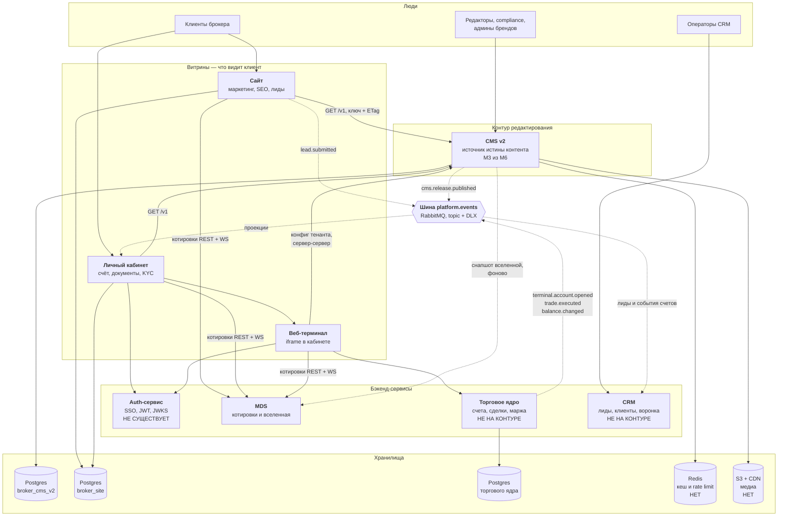
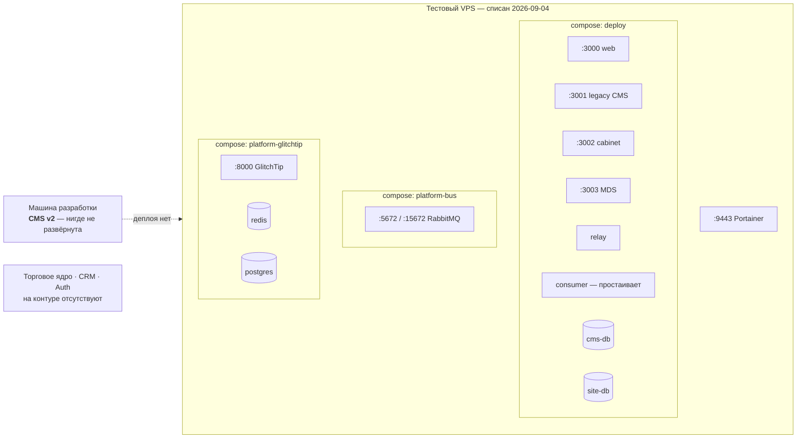

# 🌐 Карта экосистемы — все сервисы платформы

> [!info] Чем это отличается от [[Схема сервисов]]
> [[Схема сервисов]] — про **внутреннее устройство Broker CMS v2**: модули, потоки, резолв измерений. Этот документ — **уровнем выше**: вся экосистема брокера, где CMS лишь один из участников. Здесь нет внутренностей CMS, зато есть все соседи, их зоны ответственности и адреса заготовок.
>
> Собрано `2026-08-11` по обследованию контура, документам `Sait_Platform/docs` и [[Карта репозиториев и команд]].
>
> Перед публикацией из документа убраны сведения, переживающие списанную машину, — основание и границы чистки во врезке [[Окружение платформы]].
>
> 🔗 **Веб-версия для показа командам:** https://claude.ai/code/artifact/29f4e847-6538-4165-a6f8-af9f711f09e3 — страница приватная, ссылка расшаривается из меню на самой странице.

---

## 1. Контекст — кто с кем разговаривает



> [!danger] Три красных блока на схеме — это и есть весь разрыв
> **Auth-сервиса нет нигде** — ни кода, ни заготовки. **Торгового ядра и CRM нет на контуре** — их пишут внешние команды. Всё остальное существует и работает.

---

## 2. Что физически развёрнуто сегодня



Подробности состава, портов и дефицитов — [[Окружение платформы]].

---

## 3. Реестр сервисов

Легенда состояния: ✅ работает · 🟡 заготовка / MVP · 🔴 не существует · ⚪ чужая зона

### 3.1. Сервисы из твоего списка

| Сервис | За что отвечает | Где заготовка | Состояние |
|---|---|---|---|
| **CMS v2** | Единственный источник истины по контенту, структуре сайтов, дизайн-токенам, релизам и выдаче наружу | `MyxaCe/Broker_CMS` · локально `Desktop/Broker_CMS` | 🟡 M3 из M6, не развёрнута |
| **Legacy CMS** | Обслуживает текущий прод. Для нас — **только источник данных для миграции** ([[ADR-0006]]) | `MyhaC1/Broker_CMS` · VPS `deploy-cms-1` | ✅ работает, заморожена `07-27` |
| **MDS** | Котировки и вселенная инструментов. Единственное место, где живут ключи провайдеров | `MyhaC1/Broker_MDS` · VPS `deploy-mds-1` | ✅ работает, 500 инструментов |
| **Сайт** | Маркетинговая витрина: страницы, SEO, лиды, PWA, i18n ru/en | `MyxaCe/Sait_Platform` → `apps/web` · VPS `deploy-web-1` | ✅ работает, заморожен `07-27` |
| **Личный кабинет** | Логин клиента, демо-счёт, документы, уведомления, точка входа в терминал | `Sait_Platform` → `apps/cabinet` · VPS `deploy-cabinet-1` | 🟡 MVP |
| **Шина** | Асинхронный обмен между всеми сервисами. Topic-обменник + DLX | `/opt/platform-bus` на VPS | ✅ работает |
| **Торговое ядро + веб-терминал** | Счета, сделки, маржа, P&L, исполнение. Веб-терминал — iframe внутри кабинета | ⚪ внешняя команда, dev `:8888` | 🔴 на контуре нет |
| **CRM** | Лиды, клиенты, воронка продаж, работа операторов | ⚪ внешняя команда | 🔴 на контуре нет |
| **Базы данных** | `broker_cms` (legacy) · `broker_site` (лиды, сессии, outbox, проекции) · `broker_cms_v2` (ещё не заведена) | VPS `deploy-cms-db-1`, `deploy-site-db-1` | ✅ / 🔴 v2 нет |

### 3.2. Сервисы, которых в твоём списке не было

| Сервис | За что должен отвечать | Где заготовка | Состояние |
|---|---|---|---|
| **Auth-сервис (SSO)** | Выпуск короткоживущих JWT для handoff в терминал, JWKS-эндпоинт, единый логаут | **нигде** | 🔴 **не существует** |
| **Relay — публикатор outbox** | Читает `outbox` в транзакции сервиса и публикует в шину с подтверждениями | `Sait_Platform` → `apps/relay` · у CMS свой `worker:outbox` | ✅ работает |
| **Consumer — проекции событий** | Слушает `terminal.*`, строит проекцию `demo_accounts` и уведомления кабинета | `Sait_Platform` → `apps/consumer` | 🟡 простаивает, нет `BUS_URL` |
| **Планировщик потока** | Плановые публикации и снятия материалов по `publishAt` / `unpublishAt` | CMS v2 → `worker:schedule` | ✅ есть в v2 |
| **Error tracking** | Сбор ошибок всех сервисов с PII-скраббингом | `/opt/platform-glitchtip` | ✅ работает |
| **Reverse proxy + TLS** | Единственная дверь снаружи, HTTPS, увод админок с публичных портов | требования — [[Q-005]] | ⚪ состояние вне репозитория |
| **Redis** | Кеш выдачи CMS и rate limit (ТЗ разд. 9) | **нигде** — тот, что есть, принадлежит GlitchTip | 🔴 не существует |
| **S3 + CDN** | Хранение и раздача медиа с отдельного домена (ТЗ 5.3) | **нигде** — медиа в docker-томе | 🔴 не существует |
| **Vault / секреты** | Хранение кредлов вне `.env` (ТЗ разд. 6) | требования — [[Q-005]] | ⚪ состояние вне репозитория |
| **Бэкапы** | Резервные копии БД и медиа, проверка восстановления | требования — [[Q-005]] | ⚪ состояние вне репозитория |
| **CD — доставка на сервер** | Автоматический деплой из репозитория | **не заведён** | 🔴 не существует |
| **Мониторинг и алертинг** | Метрики, аптайм, оповещения. Сейчас видны только ошибки в GlitchTip | `Sait_Platform/scripts/synthetic-monitor.mjs` — разовый скрипт | 🔴 по сути нет |
| **`platform-contracts`** | Общий репозиторий схем событий и конвертов для всех команд | **не заведён** — просили у CRM | 🔴 не существует |
| **Portainer** | Управление контейнерами | VPS `:9443` | ✅ работает |

---

## 4. Разбор забытых — почему каждый важен

### 🔴 Auth-сервис — самый крупный пробел

Единственный сервис из списка выше, который **обещан внешней команде и не начат**.

В «Интеграция с терминалом» зафиксировано как наше встречное обязательство: «выпуск JWT — **наш Auth-сервис** (RS256/EdDSA + JWKS)», и «появляется вместе с нашим Auth-сервисом — триггер ADR-017 сработал (один терминал × много сайтов)».

Что от него зависит:
- **Фаза Т2 интеграции с терминалом целиком.** Без JWT/JWKS клиент не попадёт из кабинета в свой терминал своего сайта.
- **Единый логаут** — сессия терминала TTL ≤ 15 мин + тихий ре-handoff через `postMessage`.
- **Мульти-тенантность на витрине**: `token.tenant` обязан совпадать с `?site=`, иначе 403.

> [!warning] Не спутать с тем, что уже есть
> В CMS v2 есть `src/platform/auth` — это **аутентификация редакторов в админке** (роли, actor, правила пользователей). В кабинете есть свои opaque-сессии по ADR-022. Ни то, ни другое не выпускает JWT для терминала. Клиентский SSO — отдельный сервис, и его нет.

### 🔴 Бэкапы — для регулируемого домена это не опция

В проде брокера потеря `broker_site` — это потерянные лиды и документы клиентов, а потеря медиа — рассыпавшийся сайт. Плюс требование доказуемости: ответ регулятору «что было на сайте 14 марта» опирается на снапшоты релизов, которые должны где-то физически пережить инцидент.

Фактическое состояние резервного копирования в публичном репозитории не фиксируем: требования ведутся в [[Q-005]], состояние — вне репозитория.

### 🔴 CD — деплой руками, и следы этого видны

Код заливался на контур не из репозитория, поэтому ответить «какая ревизия сейчас в проде» нечем. Это же объясняет, почему происхождение каталогов на сервере пришлось восстанавливать по документам — [[Карта репозиториев и команд]].

### 🔴 Мониторинг — видны только ошибки, но не молчание

GlitchTip ловит исключения. Он не заметит, что сервис лёг целиком, что диск кончается, что консюмер простаивает две недели или что в DLQ висит сообщение — а ровно это на контуре и случилось, и никто не увидел.

### 🔴 `platform-contracts` — точка синхронизации, которой нет

Схемы событий `terminal.*`, конверт v1 и PII-политика лежат по разным репозиториям. Пока общего репозитория нет, три команды согласовывают форматы через markdown-документы — так уже было с соглашением о событиях, которое пришлось **восстанавливать по коду** ([[ADR-0017]]).

---

## 5. Где что лежит — сводка

```
GitHub
├── MyxaCe/Broker_CMS ......... CMS v2 — активная разработка
├── MyxaCe/Sait_Platform ...... сайт + кабинет + relay + consumer + пакеты
├── MyhaC1/Broker_CMS ......... legacy CMS (миграция)
└── MyhaC1/Broker_MDS ......... MDS

Тестовый VPS (списан 2026-09-04), каталог /opt
├── site-web/deploy ........... compose: web, cms, cabinet, mds, relay, consumer, 2×postgres
├── platform-bus .............. compose: RabbitMQ
└── platform-glitchtip ........ compose: GlitchTip + redis + postgres

Нигде
├── Auth · Redis · S3+CDN · CD · мониторинг · platform-contracts
└── периметр продового контура — требования в [[Q-005]]
```

---

## 6. Что это значит для порядка работ

> [!important] Порядок диктуется зависимостями, а не желанием
> 1. **Прод-контур** — прокси, TLS, vault, бэкапы. Нужен независимо от того, какой код на нём поедет, и не зависит ни от одной команды. Начинать можно сегодня.
> 2. **Auth-сервис** — разблокирует фазу Т2 терминала. Пока его нет, «шевелить» команду терминала по SSO бессмысленно: они ждут нас.
> 3. **Redis, S3, CD, мониторинг** — до боевой нагрузки, но после периметра.
> 4. **CMS v2** — M3…M6 по [[Дорожная карта]]. Миграция данных в M6 — последняя, а не первая.
>
> Пункты 1 и 2 не зависят от готовности CMS v2 и делаются параллельно с ней.
