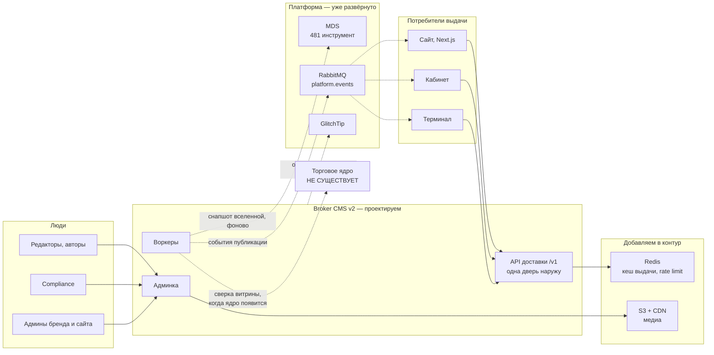
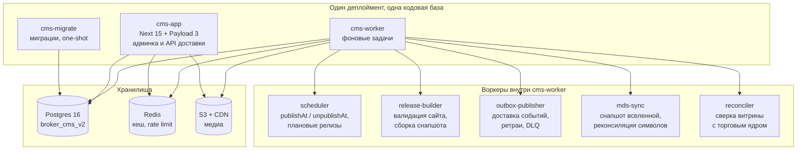
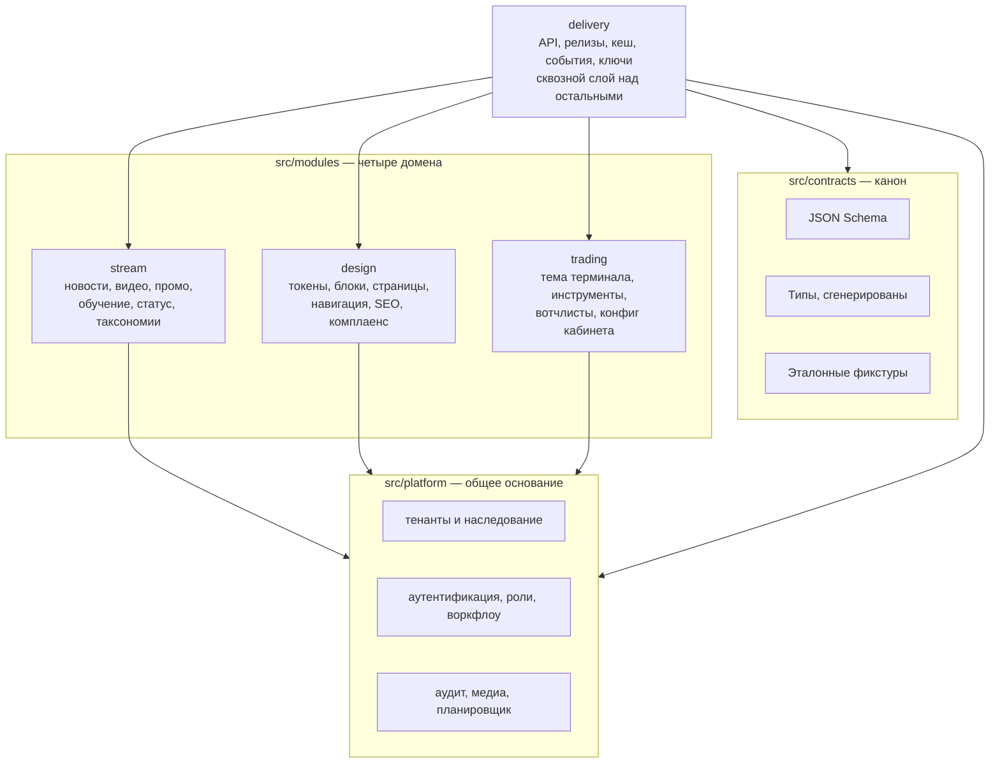
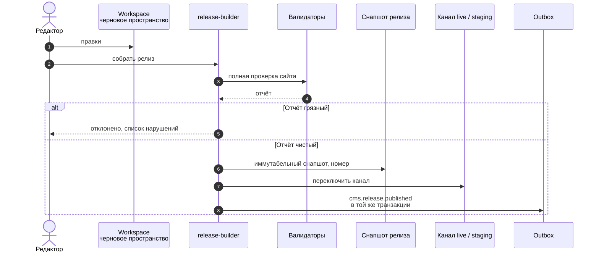
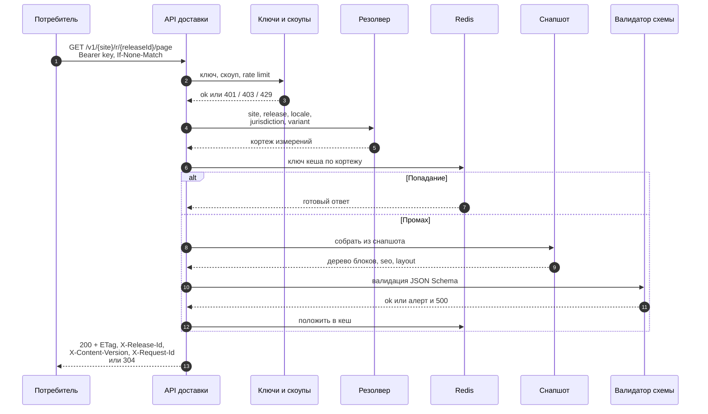
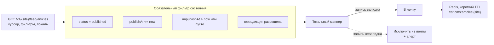
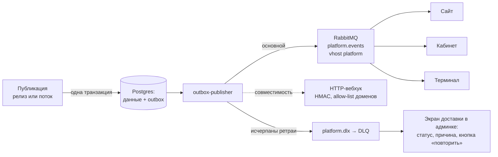
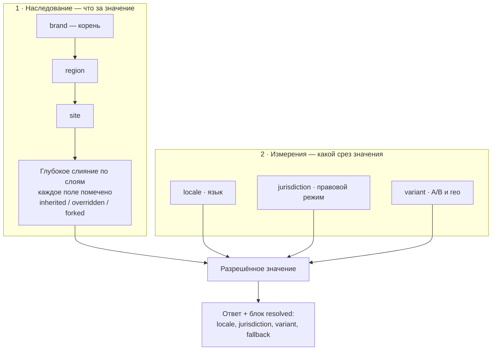
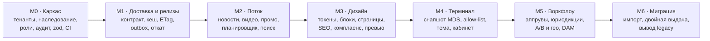

# 🧩 Схема сервисов Broker CMS v2

> [!important] Документ на утверждение
> Собран после обследования тестового VPS `2026-07-28` ([[Окружение платформы]]). Цель — чтобы заказчик проверил соответствие ТЗ **до** написания кода.
> 🔗 **Веб-версия для показа смежным командам:** https://claude.ai/code/artifact/a8543b79-4878-472a-8b5c-edccab16479f (страница приватная, ссылка расшаривается из меню на самой странице)
> Раздел [[#12. Соответствие ТЗ — проверочная таблица]] сделан специально для сверки с промтом пункт за пунктом.
> Открытые развилки собраны в [[#13. Что осталось решить]].

---

## 1. Как читать

Схема разложена от общего к частному:

1. **Уровень 0** — кто с кем говорит (контекст).
2. **Уровень 1** — что физически деплоим (процессы).
3. **Уровень 2** — как устроено внутри (модули).
4. **Потоки A–D** — как работают четыре ключевых сценария.
5. **Резолв** — как из наследования и измерений получается конкретный ответ.
6. **Порядок** — что в каком этапе появляется.

Сплошная стрелка — синхронный вызов, пунктир — асинхронный или отложенный.

---

## 2. Уровень 0 — контекст

> [!check] Что здесь важно для проверки по ТЗ
> - У потребителей **одна дверь** — `/v1`. Нативных REST/GraphQL Payload наружу нет ([[TASK-006]]).
> - CMS **никогда не ходит в MDS синхронно**: только воркер, только в свой снапшот (ТЗ 4.2). Падение MDS не мешает ни редактировать, ни отдавать.
> - Инвалидация идёт **через шину**, а не HTTP-вызовом «на удачу». HTTP-вебхук остаётся, но как второй транспорт поверх той же outbox-таблицы.

---

## 3. Уровень 1 — что деплоим

> [!note] Почему воркеры — отдельный процесс, а не таймеры внутри приложения
> Сборка релиза при допущениях ТЗ обрабатывает тысячи страниц с полной валидацией. Если она живёт в том же процессе, что и выдача, тяжёлая сборка начинает влиять на латентность отдачи, а рестарт при деплое обрывает её на середине. Отдельный процесс масштабируется и перезапускается независимо.
> Кодовая база при этом **одна** — модульные границы из ТЗ разд. 9 сохраняются, разделение только по точке входа.

---

## 4. Уровень 2 — модули внутри CMS

**Правило границ:** стрелка означает «использует **публичный интерфейс**». Импорт внутренностей чужого модуля запрещён и падает в CI ([[TASK-003]]).

**Почему `delivery` сверху, а не сбоку:** он единственный, кто знает про релизы, кеш и контракт. Домены не знают, что их данные кто-то отдаёт наружу. Это и есть условие, при котором `delivery` позже выделяется в отдельный сервис без переписывания.

---

## 5. Поток A — публикация релиза

Структура сайта (страницы, токены, навигация, конфиги) публикуется **релизами**, а не по одной записи.

**Что проверяют валидаторы — блокирующе, по ТЗ 2.4 и 3.2:**

| Проверка | Основание |
|---|---|
| битые внутренние ссылки | 3.2 |
| отсутствие перевода документа класса `legal` / `compliance` | 3.4 |
| страница юрисдикции без обязательного риск-предупреждения | 2.4 |
| изображение без `alt` | 2.4 |
| контраст цветовой роли ниже WCAG AA | 2.1 |
| несобранный или невалидный по схеме блок | 2.2 |
| стоп-словарь обещаний доходности в контенте класса `compliance` | 2.4 |
| A/B-эксперимент на блоке класса `legal` / `compliance` | [[ADR-0003]] |
| витринный торговый параметр в статусе `mismatch` или `stale` | [[ADR-0004]] |

> [!danger] Откат — это смена указателя канала
> Снапшот иммутабелен, поэтому откат не пересобирает ничего: канал `live` переводится на предыдущий номер. Секунды, а не минуты. Отсюда же берётся ответ регулятору «что было на сайте 14 марта в 12:40» — снапшот на дату существует физически.

---

## 6. Поток B — доставка структуры

Иммутабельная выдача: `Cache-Control: public, max-age=31536000, immutable`.

> [!check] Ключевые требования ТЗ, видимые на этой схеме
> - **Ни один ответ не уходит наружу без валидации схемой** (разд. 3). Провал валидации — алерт, а не тихая отдача.
> - **Ключ кеша и `ETag` считаются от полного кортежа измерений**, включая `jurisdiction` и `variant` — [[ADR-0003]]. До M5 два из них константны.
> - **Нет ключа — 401.** Не «если ключ задан, то проверим» (разд. 6).

---

## 7. Поток C — доставка потока

Новости, видео, промо, статус. Публикуются **вне релизов**, мгновенно. Короткий TTL + точечный purge по тегам.

> [!danger] Два правила, ради которых эта схема нарисована отдельно
> **1. Черновик не появляется в выдаче никогда** — фильтр состояния и времени задан **явным условием запроса**, а не полагается на умолчание ORM (ТЗ 1.3). Это отдельный обязательный автотест и пункт приёмки.
> **2. Маппер тотален.** Невалидная запись исключается из ленты и поднимает алерт — она **не роняет весь эндпоинт**. Отсутствие обязательного поля у черновика не должно ломать сборку ленты.

---

## 8. Поток D — доставка событий

**События:** `cms.release.published { site, releaseId, previousReleaseId, changedTags[] }` · `cms.stream.published { site, type, id, tags[] }` · `cms.release.rolled_back`.

Идемпотентность по `event_id`, экспоненциальные ретраи, DLQ.

> [!success] Проверено на VPS
> Учётка `cms` на шине уже существует, права `^(platform\.events|cms\..*)$` позволяют и публиковать, и объявлять собственные очереди. Запрашивать кредлы не нужно.

> [!danger] Что чиним относительно текущей CMS
> Сегодня инвалидация — HTTP-вызов с ретраями в памяти процесса, без outbox. Рестарт контейнера между попытками = потерянное событие, о котором никто не узнает. Транзакционный outbox устраняет именно это.

---

## 9. Резолв: наследование и измерения

Два разных механизма, которые часто путают.

**Наследуются** (ТЗ 3.3): токены, библиотека блоков и переиспользуемых секций, шаблоны страниц, правовой каркас, навигационный скелет, конфиг терминала, комплаенс-правила.

**Фолбэк локали:** для `marketing` разрешён, ответ помечается `"fallback": true`; для `legal` и `compliance` **запрещён** — нет перевода, релиз не собирается.

**До M5:** `jurisdiction` берётся из карточки тенанта, `variant` всегда `default`. Форма ответа при переходе на M5 не меняется — меняется только резолвер ([[ADR-0003]]).

---

## 10. Хранилища и что в них лежит

| Хранилище | Содержимое | Почему так |
|---|---|---|
| **Postgres** `broker_cms_v2` | workspace, снапшоты релизов, поток, таксономии, тенанты, роли, **аудит append-only**, **outbox**, снапшот вселенной MDS, витрина торговых условий | одна БД — одна транзакция на «публикация + событие». Разнести = потерять гарантию |
| **Redis** | кеш выдачи по кортежу измерений, rate limit по ключу, блокировки сборки релиза | ТЗ разд. 9. Сейчас в контуре отсутствует |
| **S3 + CDN** | медиа, варианты и AVIF/WebP, экспорт `theme.css` / `theme.json` | ТЗ 5.3. Раздача пользовательских файлов — с **отдельного домена** |
| **Vault / env** | секреты вебхуков и интеграций | ТЗ разд. 6: в БД открытым текстом — запрещено |

> [!warning] Аудит и иммутабельность — на уровне БД, а не приложения
> Журнал аудита и опубликованные снапшоты защищаются правами и триггерами Postgres, чтобы правка была невозможна даже при ошибке в коде. «Мы не пишем UPDATE» — не гарантия.

---

## 11. Порядок внедрения

Порядок не произвольный: изоляция тенантов, аудит и fail-closed-окружение должны существовать **до** появления данных и выдачи. Ретроспективно навесить изоляцию — значит доказывать, что утечки не было.

> [!danger] Пишем с нуля — [[ADR-0006]]
> Из существующей CMS **не берётся ни байта кода**: ни схем, ни мапперов, ни компонентов админки. Основание — 40+ ошибок, найденных другой командой в работающем на проде сервисе, и несовпадение архитектурных оснований (нет релизной модели, нет outbox, инвалидация через fire-and-forget HTTP).
> Старый сервис релевантен ровно в двух качествах: **источник данных для миграции** (M6) и **описание legacy-контракта** `/v1/cms/*`, который переходный адаптер обязан воспроизвести поверх новой модели. Подробно — [[Окружение платформы#4. Текущая CMS — только как источник данных для миграции]].
>
> Проектная планка берётся **из ТЗ, а не из текущего контура**: 20 сайтов, 8 локалей, 6 юрисдикций, 2000+ инструментов. Замеренные сегодня 481 инструмент и один сайт — снимок момента для планирования, а не ограничение модели.

---

## 12. Соответствие ТЗ — проверочная таблица

> [!check] Для сверки с промтом
> Слева — раздел ТЗ, справа — где он живёт в этой схеме.

| Раздел ТЗ | Требование | Где на схеме |
|---|---|---|
| 3 | Fail-closed везде | [[#6. Поток B — доставка структуры]], [[TASK-005]] |
| 3 | Схема — закон на обеих границах | [[#6. Поток B — доставка структуры]] (выход), `mds-sync` (вход) |
| 3 | Изоляция тенантов — правило доступа | [[#4. Уровень 2 — модули внутри CMS]], `platform` |
| 3 | Иммутабельность опубликованного | [[#5. Поток A — публикация релиза]] |
| 3 | Одна дверь наружу | [[#2. Уровень 0 — контекст]], [[TASK-006]] |
| 3 | Наблюдаемость, повторяемость событий | [[#8. Поток D — доставка событий]] |
| 3 | Доказуемость | снапшот + аудит, [[#10. Хранилища и что в них лежит]] |
| Часть 1 | Поток вне релизов, планировщик, тотальный маппер | [[#7. Поток C — доставка потока]], `scheduler` |
| Часть 2 | Токены, блоки, страницы, SEO | модуль `design` |
| 2.4 | Комплаенс-ограничители как часть движка | таблица валидаторов в [[#5. Поток A — публикация релиза]] |
| Часть 3 | Доставка: контракт, релизы, кеш, события | модуль `delivery`, потоки B, C, D |
| 3.3 | Наследование brand → region → site | [[#9. Резолв: наследование и измерения]] |
| 3.4 | Локали и юрисдикции — разные оси | там же |
| 3.5 | Outbox в одной транзакции, DLQ, повтор | [[#8. Поток D — доставка событий]] |
| Часть 4 | Тема терминала, снапшот MDS, реконсиляция | модуль `trading`, воркеры `mds-sync`, `reconciler` |
| 4.3 | Витрина торговых условий со сверкой | [[ADR-0004]], [[ADR-0005]] ⚠️ |
| 5.1 | Роли и воркфлоу | `platform`, этап M5 |
| 5.2 | Аудит append-only на уровне БД | [[#10. Хранилища и что в них лежит]] |
| 5.3 | DAM: S3, alt, варианты, карта использования | S3 + CDN, добавляем в контур |
| 6 | Безопасность: zod, ключи, заголовки, 2FA | [[TASK-005]], [[TASK-006]], [[Q-005]] |
| 7 | Наблюдаемость: логи, Sentry, метрики | GlitchTip уже развёрнут |
| 8 | Тестирование и CI | [[TASK-004]] |
| 9 | Стек и структура модулей | [[#4. Уровень 2 — модули внутри CMS]] |
| 10 | Миграция, двойная выдача | этап M6, 14 ресурсов известны |
| 13 | Анти-требования | [[Архитектура#5. Анти-требования (ТЗ разд. 13)]] |

---

## 13. Что осталось решить

| # | Вопрос | Статус |
|---|---|---|
| 1 | Витрина торговых условий без ядра — режим `unverified` с аппрувом compliance | ✅ решено `2026-07-28`, [[ADR-0005]] |
| 2 | Инфраструктура прода: S3, Redis, vault, reverse-proxy, HTTPS | 🔴 [[Q-005]] |
| 3 | Полный список потребителей выдачи (мобильное приложение? email?) | 🔴 [[Q-004]] |
| 4 | Отдельный домен для раздачи пользовательских файлов | 🔴 входит в [[Q-005]] |
| 5 | Получить от заказчика перечень 40+ дефектов текущей CMS и превратить в чек-лист negative-требований | 🟠 следствие [[ADR-0006]] |
